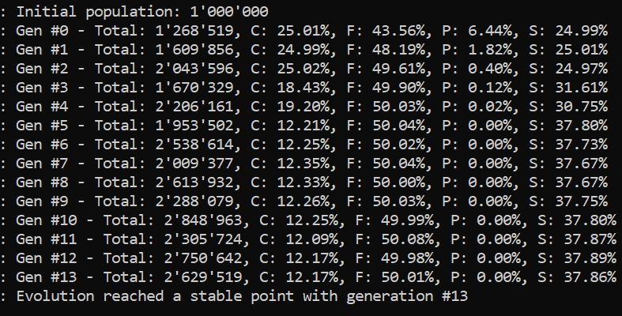
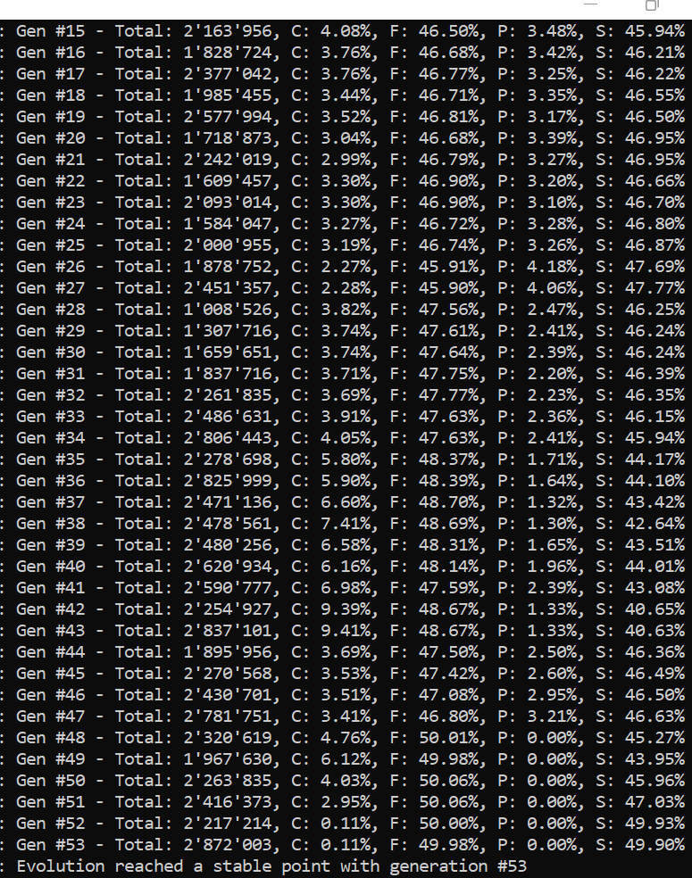
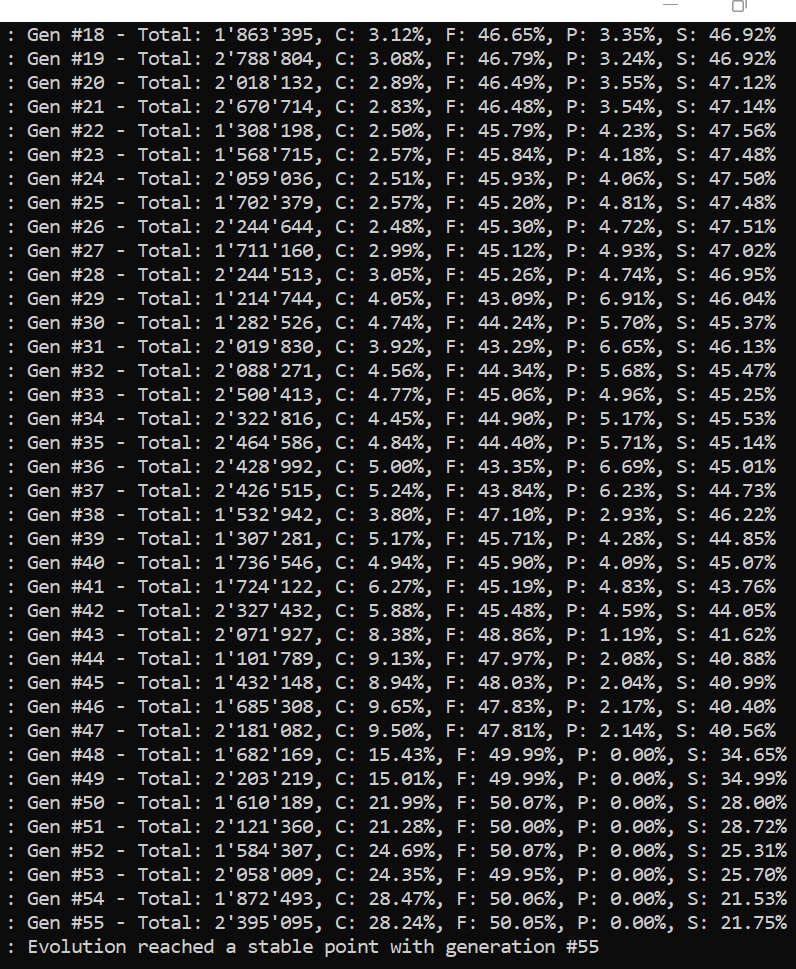
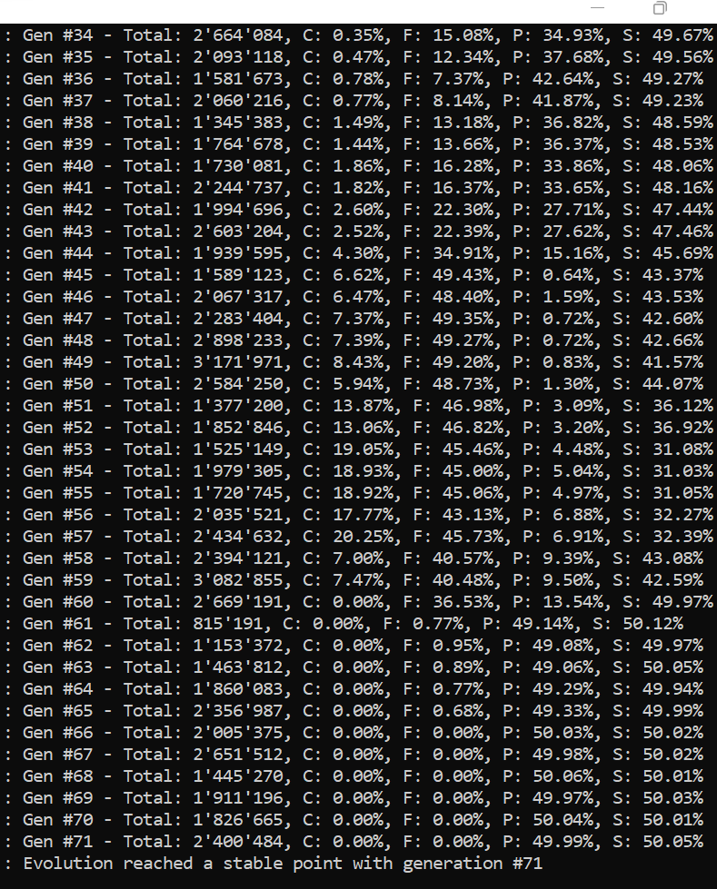
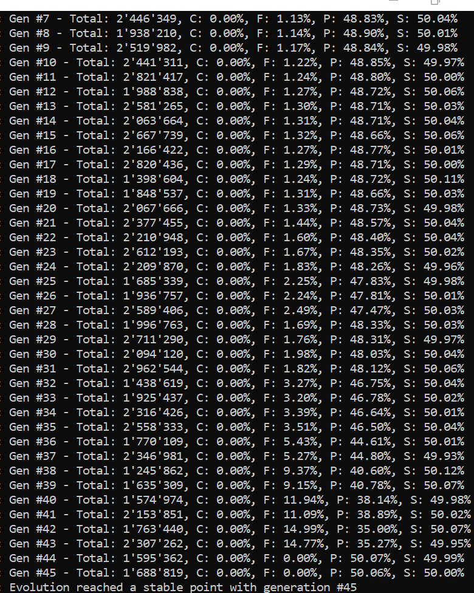

# Battle Of Sexes

<big>Implementing an evolutionary system in java </big>

*Vincenzo Mensitieri, Emanuele Scaccia, Stefano Zappa, Giordano Tambara*

*Sapienza Università di Roma*

---

## Introduction

This project is inspired by a book by Richard Dawkins named **"A selfish gene"**.

The aim of this project is to simulate an evolutionary system starting with an initial population to which the evolutionary rules will be applied, until the population reaches a state of stability. The population evolves according to precise evolution rules that will be furtherly explained later.

The population is divided into 4 types:

- **Men**
  
  - *Faithful:* prefers long courtship and they take care of their children;
  
  - *Philanderer:* doesn't want a long courtship, if they are not immediately accepted they move on without taking care of their children;

- **Woman**
  
  - *Fast:* doesn't mind copulating without a courship, independently on the type of man;
  
  - *Coy:* needs a long time courtship.

The relationship between men and women is based on a process of matching which is more favorable for them, based on the concept of **payoff**.

Payoffs are calculated by specific equations taking three parameters:

- **a,** the benefit of having a baby;

- **b,** the cost of having a baby;

- **c,** the cost of courtship.

|     | F                                              | P            |
|:---:|:----------------------------------------------:|:------------:|
| C   | $( a - \frac{b}{2} - c, a - \frac{b}{2} - c )$ | $(0, 0)$     |
| S   | $( a - \frac{b}{2}, a - \frac{b}{2} )$         | $(a - b, a)$ |

A state of stability is reached when a generation has very similar ratios of types to the previous generations.

---

## Adopted Model

### Setting

The setting of the project has been chosen to be built around the concept of a **Government** that manages all the matchings. This Government is supported by institutions that supervise the phases the individuals have to pass through.

An important figure is the **Counselor**: he is meant to oversee the matching procedure, aiming to assign the most suitable option for everyone. A Counselor may serve just for one generation, after he has finished matching the people he will be retiring.

### Matching

In the model adopted in this project, courtship was decided to be unilateral: men decide if they want to propose to a woman, and women decide whether to accept or not the proposal.

It is important to highlight that matching is determined by both sexes’ preference.

In fact, our model is inspired by the **Stable Matching Problem** and, consequently, shares core features with the Gale-Shapley Algorithm: a parametrized number of men (default number was chosen to be 2) of random types interact with the same number of randomly picked women.

Every man expresses a predilection towards its possible partner: with most triplets of parameters, there will be a union that is better for him than the other one based on the payoff he will get for being with that type of woman. The bigger payoff, the better.

The same exact modality happens for the other sex; nevertheless, the choice is limited by the random pick of the individuals involved; in fact, during a single match, we can end up with every person of the same sex being of the same type. In that case, there is just one "obliged" option to select.

The main difference with the original Gale-Shapley Algorithm is that, during a cycle, we don't want to necessarily pair every "participant" immediately. Instead, we couple only the individuals that prefer each other; if not coupled, the person will be sent again to the *Counselor* and re-picked for another cycle.

### Exceptions

Obviously, coherently to what was precedently stated, Philanderer men and Coy women cannot interbreed in any case; this is taken in consideration in the code: in fact they will never form a couple.

Furthermore, in theory, the Philanderer men shouldn't form a couple of any kind; according to Dawkins' book, they should leave their partner after copulating. Nevertheless, given that they can pair only with Fast women, for the sake of the project, there isn't any practical difference in mating with different women or being in a monogamous relationship.

Everyone is given the same opportunity to have a defined number of children, so, doing it with the same Fast woman or with different ones will not change the result.

### Children

On the other hand, in case a couple is formed, it will procreate and pass their children to the next generation.

The number of children varies from 1 to 4, with every option having a parameterizable percentage to happen (Default values have been chosen to be 10% probability to have just one child, 20% for two, 50% for three and 20% for four).

These values have been chosen in order to have a slight increase in the population when we pass to the next generation (the average is 2.8 children).

---

## Software Structure

In the main package we have 4 subpackages (each with its classes) and 2 main classes.

### BattleOfSexes

#### BattleOfSexesApplication:

This is the first code to be run, it mostly contains the parameterizable properties and variables. Automatically, **Spring** executes the methods marked with `@Autowired`, setting the parameters.

#### Emulator:

Emulator is the core of the project: it starts from a random population (always based on given probabilities) and computes the next generations.

The method `isStable()` checks if the current and the previous populations have similar ratios among the various types: in that case, we say that the population has reached a state of **evolutionary stability**.

For every generation, it prints the total population and the ratios (in percentage) of the types, until it reaches evolutionary stability or for 100 generations.

### Beans

This package contains components used to collect data.

#### PayoffTable:

This class is used to gather the data from the Payoff Table, namely to compute the payoffs of every type of individual in every single situation.

We initially define 3 `float` parameters: **a**, **b**, **c**, these will be used to calculate the payoffs for each pair of types based on the respective formula. Thus, 8 methods have been implemented to return every single value we need, two for each pair (4 pairs): one man to woman, one to woman to man.

Plus, there is a method `get()` that takes as parameters two ordered types and returns the respective payoff value.

#### RandomPicker

This class contains the methods that are needed to randomize different parts of the simulation.

We set the attributes `sons`, maleGenes and femaleGenes as instances of `ProbabilityWheel`; we create 3 methods (`setSons(...)`, `setMaleGenes(...)`, `setFemaleGenes(...)`) that Spring uses to set the data based on the given probabilties.

The other 3 methods `sons()`, `maleGenes()`, `femaleGenes()` return a random value of the regarding type based on the given probabilities.

### Matching

#### Counselor

Counselor, as we said, extends `Thread`, and it is run asynchronously.

When used in the `compute()` method of Generation, a number (by default 4) of them are created and run simultaneously and stopped when they finish or after a timeout of 3 seconds.

Until we have enough people, we run an algorithm similar to the Gale-Shapley for 3 random women and 3 random men; the only difference is that the only couples formed are the ones that match the partners' top preferences.

#### Generation

Generation is a synchronous object that takes as arguments a list of Man and a list of Women and puts them in two separated queues.

The purpose of this object is to generate, through the method `compute()`, the next generation of children based, obviously, on the current generation and its characteristics.

The method `compute()` uses a specified number of Counselors, waits for them to finish or stops them after a timeout, after which we'll have the children which will be the population of the next generation.

Other methods contained in this class are `getTypeRatios()`, that returns the various percentages of the different types in the new generation under a `Map`, `getTotalChildren()` that returns the total number of them and `toString()` which returns verbose information about the generation.

Lastly, we have `addCouple(...)`, through which the Counselors can register the children a couple to take part in the next generation.

### Models

This package contains the classes determining the individuals' attributes and their behaviour.

#### GeneType

Genetype is a functional interface that only has one method: `getCode()`.

Being an interface, it lacks the actual implementation which will be written when called in specific situations.

#### Human

This is an abstract class whose constructor takes the GeneType type object as an argument.

From this class we will derive the classes Man and Woman.

#### Man

This class extends `Human`, so it gets the attributes from its superclass; we define the `getType()` method which returns the type associated to the Man object.

Here has been implemented the `topPreferences(...)` method that, based on the payoff that Women would get by being with a specific type of man, ranks the possible partners and returns the best option for the woman taken in consideration.

Then we define the instance enum Type, which implements Genetype; here we define the two types of genes a man can have: `Faithful(F)`, `Philanderer(P)`.

#### Woman

This class is basically the same thing as Man but it obviously contains the `topPreferences(...)` method for the Men, which returns the best type of woman for the man taken in consideration based on the value of the payoffs, and it defines the genes regarding women: `Coy(C)`, `Fast(S)`.

#### Couple

In this class we define a Man and a Woman from their classes and a set of Humans, which are the children.

A couple takes as argument the father and the mother and contains an initially empty set of children; with the method procreate, we generate the offspring from the partners taken as argument: the number is random and defined by the `RandomPicker` class which we talked before, and the sex has a 50/50 chance.

Sons will inherit the father's type, Daughters the mother's one.

### Utils

#### ProbabilityWheel

This is a utility class, used to pick random items with determined probabilities.

It takes a generic parameter `<T>`, which represents the type of object that will be picked. We use one map to store the values of the probabilities, in percentage, regarding the items, called "originals" and one `LinkedHashMap` to store the decimal probability value.

It has 3 methods. The first and most important one is `spin()`; this method "spins the wheel" returning a random object based on the given probabilities.
Then we have the methods `getProbabilities()` that returns originals, and `getRanges()` that returns ranges.

## Case Studies

### Default Settings

| a   | b   | c   |
|:---:|:---:|:---:|
| 15  | 20  | 3   |

These are the settings written by Dawkins; we observe that, with our model, Philanderers die out, while coy remain stable as one third of the Fast.

This happens because Philanderers are not preferred from both types of women, and Fast women are more desirable (based on the payoffs).

### All Parameters to 0

| a   | b   | c   |
|:---:|:---:|:---:|
| 0   | 0   | 0   |

For these values, the matching is *Random*, in the sense that no one has any incentive in choosing one specific partner.

The interesting result is that, while the proportions between women types can vary, for men the situation is different: Philanderers always die out.

Probably this is due to their inherent limit of procreating only with Fast women.

### Negative Parameter b

| a   | b   | c   |
|:---:|:---:|:---:|
| 15  | -20 | 3   |

Here we made the **b** parameter negative, so that it changes all the preferences.

Now Fast women prefer Philanderers. Faithful and Coy die out.

### 99% Philanderers

| a   | b   | c   | P   | F   |
|:---:|:---:|:---:|:---:|:---:|
| 15  | 20  | 3   | 99% | 1%  |

The evolutionary parameters are the same, what changes is the percentage of starting population.

We see how Faithful begin to grow in population but the majority of philanderers, even if not mostly desirable, defeats them.

